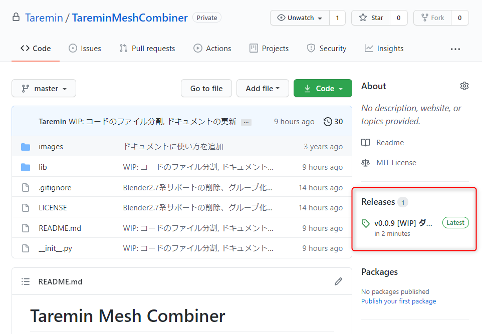
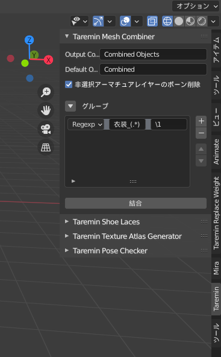
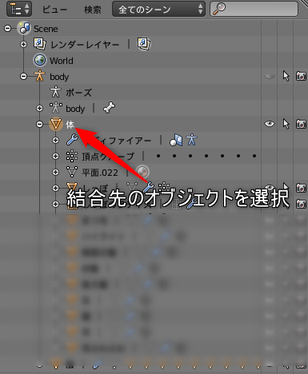

# Taremin Blender Plugin

## なにこれ？

Taremin が Blender を使う上で便利そうな機能を詰め込んだ Blender addon です。
現在は FBX 出力する前に表示状態になっているメッシュオブジェクトのモディファイアを適用して結合する機能のみです。

## インストール

zip ファイルをダウンロードして、「ファイル」「ユーザー設定」「アドオン」「ファイルからアドオンをインストール」を選択し、ダウンロードした zip ファイルをインストールします。

3D View: Taremin Blender Plugin という項目がアドオン一覧に追加されるのでチェックボックスをオンにします。

## 使い方

3Dビューのときに左のツールパネルに "Taremin" という項目が追加されているので選択します。

結合先のオブジェクトをアクティブにして "最適化" ボタンを押すと、オブジェクトが結合されて非表示状態のオブジェクトやFBX出力に不必要なオブジェクトが削除されます。

## シェイプキーを持つオブジェクトがある場合

Blenderではシェイプキーを持つオブジェクトはモディファイアを適用することができません。
そこで [Apply Modifier アドオン](https://sites.google.com/site/matosus304blendernotes/home/download) がインストールされている場合、このアドオンを使って適用します。

## 更新履歴

- 0.0.5:
  - "Merge."から始まる頂点グループをオブジェクト結合後に重複頂点の削除をする機能を追加
  - ".NoMerge" で終わるオブジェクトはオブジェクト結合の対象外にするように変更
  - アーマチュアが非表示のときに正常に処理ができないバグの修正
- 0.0.4: 非選択アーマチュアレイヤーのボーン削除機能を追加、UVマップのリネーム時、マテリアルのテクスチャスロットもリネームするように修正
- 0.0.3: シェイプキーを設定しているオブジェクトがある場合 Apply Modifier アドオンを使って適用
- 0.0.2: 非表示レイヤーのオブジェクト削除オプションを追加
- 0.0.1: 初期実装
